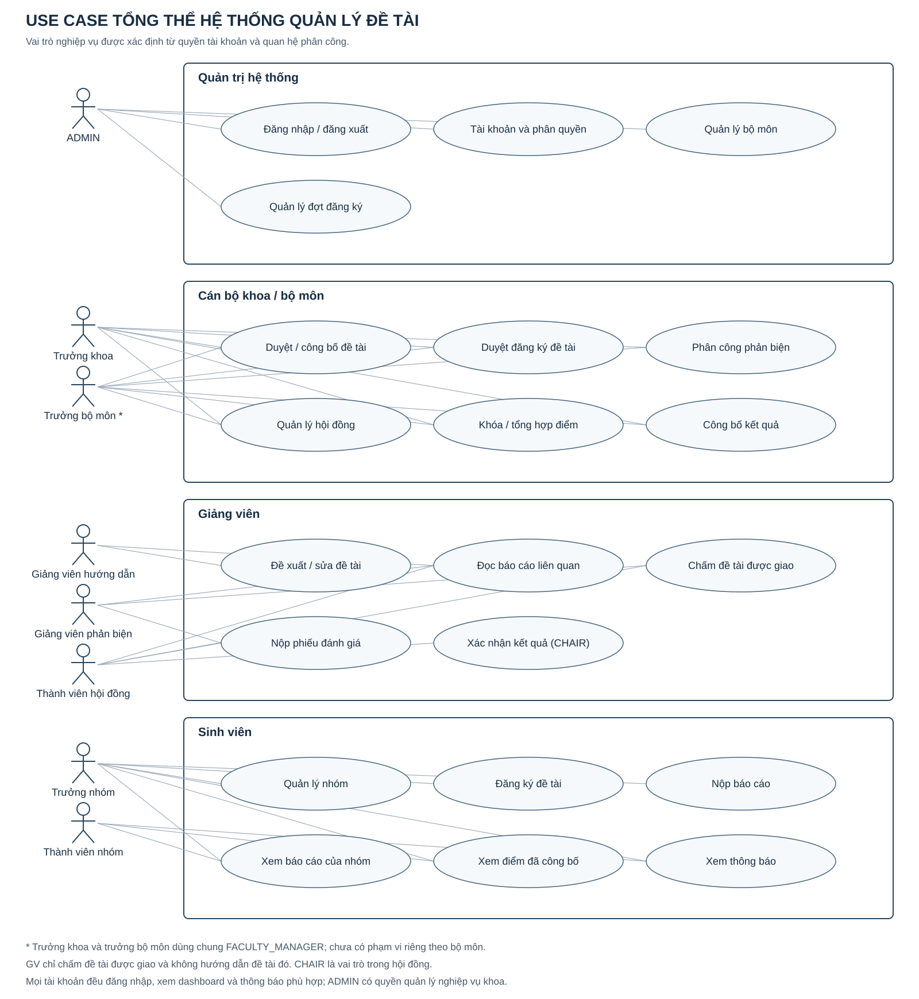

# Nội dung báo cáo — Thành viên 1

## Chương 1. Giới thiệu đề tài

### 1.1 Lý do chọn đề tài

Quá trình quản lý đề tài sinh viên liên quan nhiều vai trò, nhiều mốc thời gian và các trạng thái phụ thuộc nhau. Khi thông tin nằm rải rác trong biểu mẫu và bảng tính, khoa khó kiểm soát trùng đề tài, đăng ký ngoài hạn, phân công chưa hợp lệ và công bố điểm. Nhóm chọn xây dựng một hệ thống web tập trung để chuẩn hóa quy trình từ khởi tạo đợt đến công bố kết quả.

### 1.2 Mục tiêu

Hệ thống cung cấp xác thực và phân quyền; quản lý tài khoản, bộ môn, đợt đăng ký; tạo nền dữ liệu và hợp đồng tích hợp cho module đề tài, nhóm sinh viên, báo cáo và chấm điểm. Luật nghiệp vụ được kiểm tra tại service và được bảo vệ bằng ràng buộc cơ sở dữ liệu khi phù hợp.

### 1.3 Phạm vi và đối tượng

Phạm vi gồm đề tài môn học, nghiên cứu khoa học, tiểu luận chuyên ngành và khóa luận tốt nghiệp. Người dùng gồm quản trị viên, cán bộ khoa, giảng viên và sinh viên. Sản phẩm là ứng dụng Spring Boot triển khai theo mô hình MVC, giao diện Thymeleaf và cơ sở dữ liệu MySQL.

### 1.4 Phân công

| Thành viên | MSSV | Nhiệm vụ |
|---|---:|---|
| Trang Sĩ Hoàng | 24162035 | Nền tảng và tích hợp; tài khoản–phân quyền, bộ môn, đợt đăng ký; database/JPA toàn hệ thống; SMTP/EmailService, AOP, layout chung; use-case, FR/NFR, ma trận quyền, kiểm thử và Chương 1–2 |
| Vũ Trọng Hưng | 24162053 | Module đề tài, giảng viên hướng dẫn, nhóm sinh viên, đăng ký đề tài và nộp báo cáo |
| Trần Hào Kiệt | 24162065 | Module phản biện, hội đồng, chấm điểm, công bố kết quả, thông báo, dashboard và triển khai |

### 1.5 Thiết kế và yêu cầu toàn hệ thống

Hình 1.1. Các tác nhân và chức năng của hệ thống. Ma trận quyền, FR/NFR và bảng phân công đến lớp nằm trong `docs/system-requirements.md`; từ điển bảng/cột từ model nằm trong `docs/data-dictionary.md`.

Trưởng khoa và trưởng bộ môn hiện dùng chung FACULTY_MANAGER, chưa tách quyền theo bộ môn. GVHD/GVPB/thành viên hội đồng/trưởng nhóm được phân biệt qua relationship mapping. Không coi việc ẩn menu là bảo vệ dữ liệu.

## Chương 2. Cơ sở lý thuyết áp dụng

### 2.1 MVC và Spring MVC

Controller nhận HTTP request và trả view Thymeleaf; service xử lý nghiệp vụ; repository truy cập dữ liệu. Cấu trúc thể hiện tại `controller`, `service`, `repository`, `model`. Ví dụ `FacultyController` nhận form đợt, còn `RegistrationPeriodService` kiểm tra lịch và trạng thái.

### 2.2 Spring Data JPA

JPA ánh xạ `User`, `Role`, `Department`, `RegistrationPeriod` sang MySQL. Các repository kế thừa `JpaRepository` để truy vấn và khóa quan hệ. `UserRepository` dùng `@EntityGraph` tải vai trò/bộ môn cho xác thực mà không phụ thuộc Open Session in View.

### 2.3 Spring Security

`SecurityConfig` mã hóa BCrypt, bật CSRF mặc định, định tuyến theo vai trò và bật method security. `AdminController` và `FacultyController` dùng `@PreAuthorize`; vì vậy việc ẩn menu trên giao diện không phải lớp bảo vệ duy nhất.

### 2.4 Spring Validation

Các DTO trong `dto` dùng `@NotBlank`, `@Email`, `@Size`, `@NotNull`. `UserUpdateForm` chỉ nhận thông tin hồ sơ và vai trò, không nhận password hash. `BindingResult` giữ biểu mẫu và lỗi sau POST. Service kiểm tra thêm dữ liệu trùng, quyền tự sửa và lịch liên trường.

### 2.5 Transaction Management

Các thao tác ghi ở service dùng `@Transactional` để cập nhật nguyên tử. Nếu một kiểm tra thất bại, exception làm rollback toàn bộ thay đổi. `TransactionAspect` ghi thời gian thực thi để hỗ trợ theo dõi tích hợp mà không trộn mã log vào từng service.

### 2.6 AOP cho quan tâm xuyên suốt

`LoggingAspect` ghi thời gian/kết quả gọi hàm và ném lại exception. `SecurityAspect` ghi người thao tác, không thay thế kiểm tra phân quyền. `TransactionAspect` đo thời gian; Spring mới thực hiện commit/rollback qua `@Transactional`.

### 2.7 Email và xử lý bất đồng bộ

Spring Boot Mail cung cấp JavaMailSender. EmailService nhận người nhận, tiêu đề và nội dung, chạy trên mailExecutor với hàng đợi giới hạn và timeout SMTP. Mật khẩu SMTP đọc từ biến môi trường. Mặc định tắt mail; DISABLED và FAILED không được coi là đã gửi.

TV1 cung cấp hạ tầng và contract trong `docs/mail-integration.md`. TV3 nối mail vào nghiệp vụ sau commit, kiểm tra người nhận và chống gửi trùng. Chỉ SMTP nhận thư chưa chứng minh thư đã đến hộp thư người dùng.
