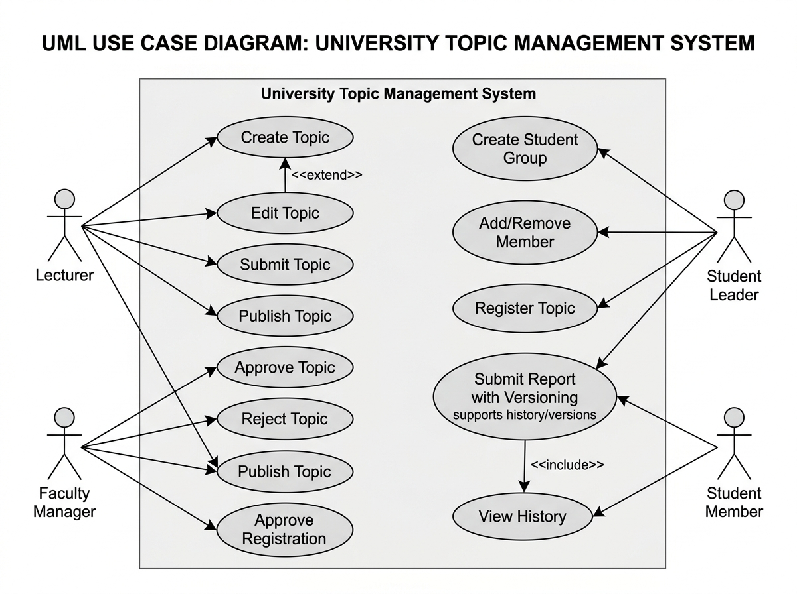
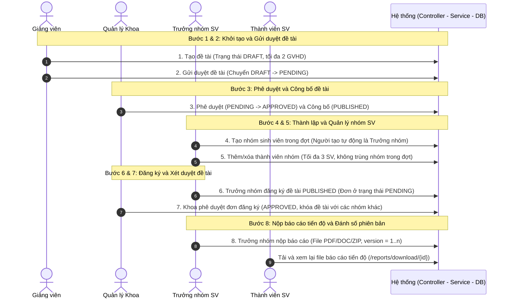
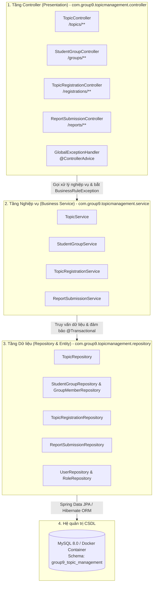
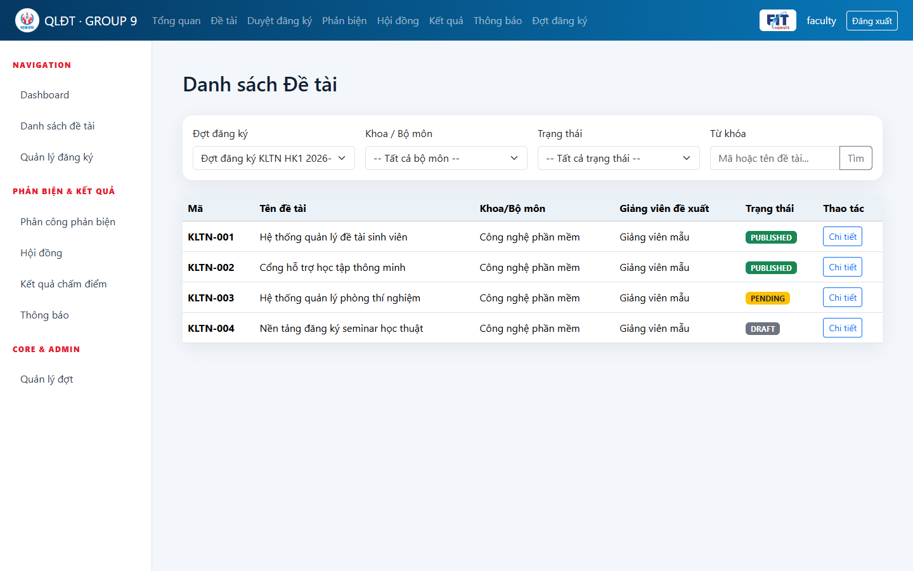
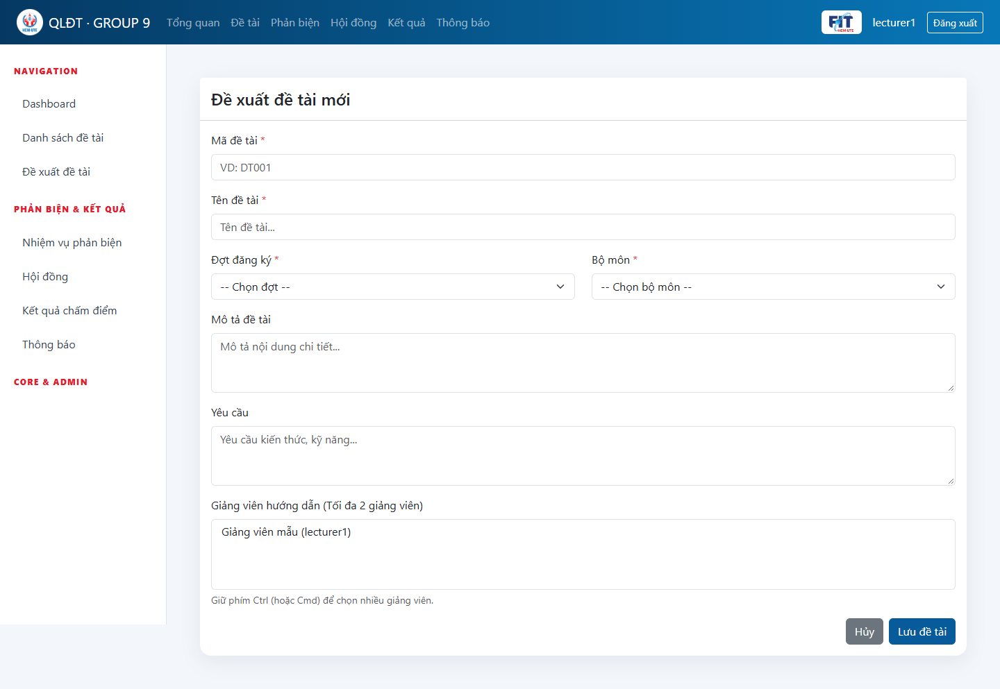
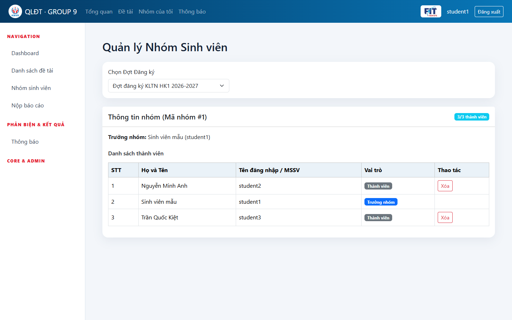
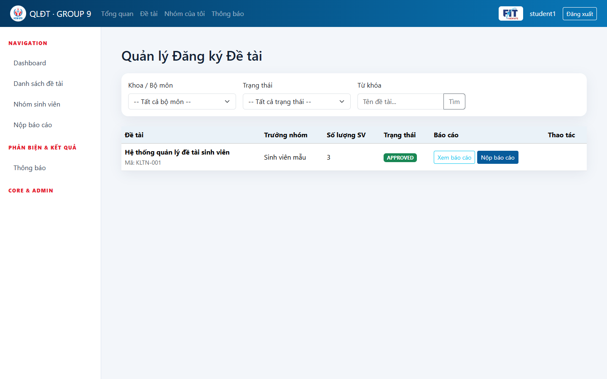
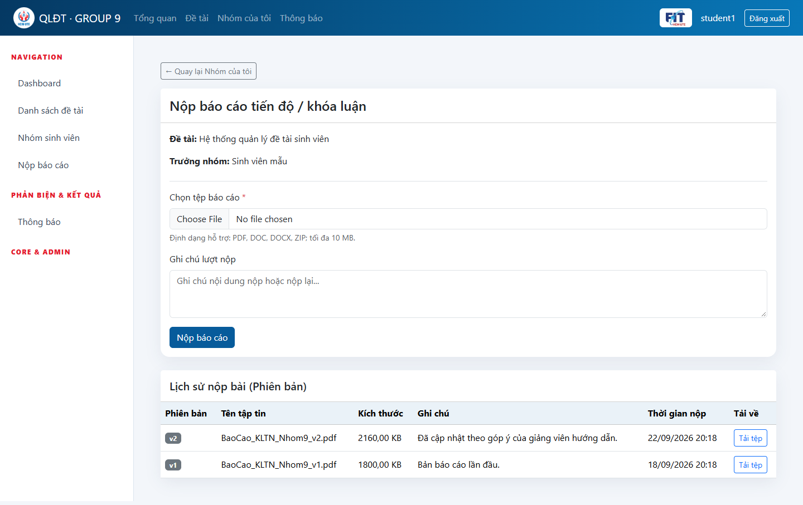

# Chương 3: Thiết kế và Mô tả Module Quản lý Đề tài & Nhóm Sinh viên (Thành viên 2)

**Thành viên thực hiện**: Vũ Trọng Hưng (MSSV: 24162053)
**Phân hệ phụ trách**: Quản lý Đề tài, Quản lý Nhóm Sinh viên, Đăng ký Đề tài & Nộp Báo cáo Tiến độ.

---

## 3.1 Sơ đồ Use Case (Use Case Diagram)

Sơ đồ Use Case tổng quan thể hiện sự tương tác giữa các Tác nhân (Actors) và các Chức năng (Use Cases) thuộc phân hệ Thành viên 2 trong Hệ thống Quản lý đề tài khóa luận/luận văn:

> **Tệp thiết kế đính kèm**:
> - File thiết kế sơ đồ gốc dạng DrawIO: [use-case-member2.drawio](use-case-member2.drawio)
> - Ảnh sơ đồ PNG: [use-case-member2.png](use-case-member2.png)

---

## 3.2 Danh sách Tác nhân (Actors) & Phân quyền RBAC

| STT | Tác nhân (Actor) | Vai trò trong Phân hệ (Role & Responsibilities) | Quyền hạn tương ứng trong Spring Security |
|:---:|:---|:---|:---|
| 1 | **Giảng viên (Lecturer)** | Đề xuất đề tài mới (`DRAFT`), gán tối đa 2 GVHD, chỉnh sửa nội dung đề tài thuộc quyền quản lý, gửi đề tài lên Khoa để duyệt (`PENDING`). | `ROLE_LECTURER` |
| 2 | **Bộ môn / Khoa (Faculty Manager)** | Xem xét phê duyệt/từ chối đề tài (`APPROVED` / `REJECTED` kèm lý do bắt buộc); Công bố đề tài đã duyệt (`PUBLISHED`); Phê duyệt/từ chối đơn đăng ký đề tài của nhóm sinh viên. | `ROLE_FACULTY_MANAGER`, `ROLE_ADMIN` |
| 3 | **Trưởng nhóm Sinh viên (Student Group Leader)** | Khởi tạo nhóm sinh viên theo đợt đăng ký, mời/thêm thành viên, xóa thành viên; Đại diện nhóm đăng ký đề tài đã công bố; Nộp và nộp lại các phiên bản báo cáo tiến độ (`version` tăng dần). | `ROLE_STUDENT` (có cờ `is_leader = true`) |
| 4 | **Thành viên Sinh viên (Student Member)** | Tham gia nhóm sinh viên, xem thông tin nhóm, theo dõi trạng thái đề tài đăng ký, xem lịch sử báo cáo và tải tệp báo cáo tiến độ về máy. | `ROLE_STUDENT` |

---

## 3.3 Quy trình và Luồng Xử lý Nghiệp vụ (8 Bước Hoàn chỉnh)

Toàn bộ quy trình nghiệp vụ của Phân hệ Thành viên 2 được tổ chức thành chuỗi liên hoàn 8 bước khép kín:

### Chi tiết 8 bước thực thi:

1. **Bước 1 — Giảng viên tạo đề tài**: Giảng viên đăng nhập hệ thống, nhập thông tin đề tài (Mã đề tài, Tên đề tài, Mục tiêu, Yêu cầu, Chọn Khoa/Bộ môn, Chọn Đợt đăng ký và chọn tối đa 2 GVHD). Hệ thống kiểm tra thời hạn đề xuất của giảng viên và lưu đề tài ở trạng thái `DRAFT`.
2. **Bước 2 — Giảng viên gửi duyệt**: Khi hoàn thiện thông tin, giảng viên bấm nút "Gửi duyệt". Trạng thái chuyển từ `DRAFT` (hoặc `REJECTED`) sang `PENDING`.
3. **Bước 3 — Khoa duyệt và công bố đề tài**: Quản lý Khoa xem danh sách đề tài chờ duyệt. Nếu đạt yêu cầu, Khoa bấm "Duyệt" (`APPROVED`). Khi đến thời điểm mở cho sinh viên, Khoa bấm "Công bố" (`PUBLISHED`) để đề tài hiển thị công khai. Nếu chưa đạt, Khoa bấm "Từ chối" kèm lý do phản hồi chi tiết để GV chỉnh sửa.
4. **Bước 4 — Sinh viên tạo nhóm**: Trong thời gian sinh viên đăng ký, một sinh viên tạo nhóm mới cho đợt đăng ký đó. Hệ thống khởi tạo bản ghi `StudentGroup`, đồng thời tự động thêm sinh viên này vào bảng `GroupMember` với cờ `is_leader = true`.
5. **Bước 5 — Thêm/xóa thành viên nhóm**: Trưởng nhóm nhập tên đăng nhập của các bạn cùng nhóm. Hệ thống kiểm tra ràng buộc: mỗi nhóm tối đa 3 thành viên và sinh viên chưa tham gia bất kỳ nhóm nào khác trong cùng đợt. Trưởng nhóm có quyền xóa thành viên nếu có thay đổi.
6. **Bước 6 — Trưởng nhóm đăng ký đề tài**: Trưởng nhóm duyệt danh mục các đề tài đã `PUBLISHED`, chọn đề tài phù hợp và bấm "Đăng ký". Hệ thống ghi nhận bản ghi `TopicRegistration` với trạng thái `PENDING`. Thành viên thường bấm đăng ký sẽ bị chặn.
7. **Bước 7 — Khoa duyệt đăng ký đề tài**: Quản lý Khoa tra cứu danh sách đăng ký theo đợt và bộ môn. Khi Khoa phê duyệt (`APPROVED`) cho nhóm, hệ thống xác nhận đề tài thuộc về nhóm đó và ngăn phê duyệt trùng cho nhóm khác.
8. **Bước 8 — Trưởng nhóm nộp và tải lại báo cáo**: Khi đề tài đã được duyệt chính thức, Trưởng nhóm truy cập chức năng nộp báo cáo tiến độ, đính kèm file (PDF, DOC, DOCX, ZIP) và ghi chú. Khi nộp lại, hệ thống tự động tăng phiên bản (`version = latestVersion + 1`) và lưu trữ an toàn. Trưởng nhóm, thành viên nhóm, GVHD và Quản lý Khoa có quyền xem lịch sử và tải file về máy.

---

## 3.4 Kiến trúc Phân tầng Controller – Service – Repository

Tuân thủ kiến trúc chuẩn Spring Boot Enterprise, hệ thống phân chia rõ ràng trách nhiệm giữa các tầng. Lưu ý: Tầng tiếp nhận HTTP Request đã được chuẩn hóa vào package **`com.group9.topicmanagement.controller`** (được đổi tên và refactor từ package `web` cũ):

### 1. Tầng Controller (`com.group9.topicmanagement.controller`)
- **`TopicController`**: Định tuyến `/topics`, xử lý hiển thị danh sách đề tài, lọc đa tiêu chí, tạo mới đề tài (`/create`), chỉnh sửa (`/edit/{id}`), gửi duyệt (`/submit/{id}`), duyệt (`/approve/{id}`), từ chối (`/reject/{id}`), và công bố (`/publish/{id}`).
- **`StudentGroupController`**: Định tuyến `/groups`, xử lý xem trang nhóm của tôi (`/my-group`), tạo nhóm (`/create`), thêm thành viên (`/add-member`), xóa thành viên (`/remove-member`).
- **`TopicRegistrationController`**: Định tuyến `/registrations`, xử lý sinh viên đăng ký đề tài (`/register`), quản lý khoa duyệt đăng ký (`/approve/{id}`) và từ chối đăng ký (`/reject/{id}`).
- **`ReportSubmissionController`**: Định tuyến `/reports`, xử lý nộp báo cáo (`/submit`), xem lịch sử các phiên bản (`/history/{id}`), tải file báo cáo an toàn (`/download/{id}`).
- **Xử lý ngoại lệ chuẩn hóa (NFR-02)**: Các Controller bắt chính xác `BusinessRuleException` và `IllegalArgumentException` để đưa thông báo lỗi thân thiện vào `errorMessage` trên UI/FlashAttribute. Các lỗi hệ thống không lọt qua mà chuyển về `GlobalExceptionHandler` xử lý tập trung (mã lỗi HTTP 400, 403, 404, 500).

### 2. Tầng Dịch vụ (`com.group9.topicmanagement.service`)
- Chứa toàn bộ logic kiểm tra quy tắc nghiệp vụ (Business Rules Validation).
- Toàn bộ các phương thức ghi/sửa dữ liệu được bọc bởi `@Transactional` nhằm bảo đảm tính toàn vẹn (ACID).
- Tích hợp ghi log bảo mật và kiểm toán (`LoggingAspect`, `SecurityAspect`).

### 3. Tầng Truy cập Dữ liệu (`com.group9.topicmanagement.repository`)
- Kế thừa `JpaRepository` của Spring Data JPA, hỗ trợ tự động sinh câu lệnh truy vấn tối ưu, hỗ trợ phân trang và sắp xếp `Pageable`.
- Kiểm tra trùng lặp và dữ liệu mới nhất thông qua các phương thức repository: `existsByStudentIdAndPeriodId`, `findApprovedRegistrationForTopic`, `findLatestByRegistrationId`.

---

## 3.5 Bảng Quy tắc Nghiệp vụ Chi tiết (Business Rules)

### 1. Quy tắc Chức năng (Functional Requirements: FR-01 -> FR-12)

* **FR-01 (Tạo đề tài)**: Giảng viên chỉ được tạo đề tài trong khung thời gian đợt đăng ký quy định (`lecturerStart <= now <= lecturerEnd`). Đề tài khởi tạo ở trạng thái `DRAFT`. Mỗi đề tài có **tối đa 2 Giảng viên hướng dẫn** (`advisors.size() <= 2`).
* **FR-02 (Chỉnh sửa & Gửi duyệt)**: Chỉ chủ đề tài mới có quyền sửa khi ở trạng thái `DRAFT` hoặc `REJECTED`. Bấm "Gửi duyệt" chuyển trạng thái sang `PENDING`.
* **FR-03 (Phê duyệt & Từ chối đề tài)**: Chỉ Quản lý Khoa / Quản trị viên (`ROLE_FACULTY_MANAGER`, `ROLE_ADMIN`) mới có quyền duyệt (`APPROVED`) hoặc từ chối (`REJECTED`). Khi từ chối, **lý do từ chối là bắt buộc** không được để trống.
* **FR-04 (Công bố đề tài)**: Đề tài sau khi `APPROVED` phải được Khoa bấm "Công bố" (`PUBLISHED`) mới hiển thị trong danh mục cho sinh viên đăng ký.
* **FR-05 (Khởi tạo nhóm)**: Sinh viên tạo nhóm trong thời gian đợt mở cho sinh viên (`studentStart <= now <= studentEnd`). Người tạo mặc định là Trưởng nhóm (`is_leader = true`).
* **FR-06 (Quy mô nhóm)**: Mỗi nhóm có **tối đa 3 sinh viên**. Mỗi sinh viên chỉ được phép tham gia **tối đa 1 nhóm** trong cùng một đợt đăng ký.
* **FR-07 (Thêm/Xóa thành viên)**: Chỉ Trưởng nhóm mới có quyền mời/thêm hoặc loại bỏ thành viên khỏi nhóm.
* **FR-08 (Quyền đăng ký đề tài)**: Chỉ **Trưởng nhóm** mới có quyền đăng ký đề tài cho nhóm. Đề tài đăng ký bắt buộc phải ở trạng thái `PUBLISHED`.
* **FR-09 (Tính duy nhất trong duyệt đề tài)**: Đề tài chỉ được duyệt chính thức (`APPROVED`) cho **đúng 1 nhóm** duy nhất. Hệ thống ngăn chặn việc duyệt trùng đề tài cho nhiều nhóm.
* **FR-10 (Điều kiện nộp báo cáo)**: Nhóm sinh viên chỉ được nộp báo cáo tiến độ khi đơn đăng ký đề tài đã được Khoa phê duyệt chính thức (`APPROVED`). Không được nộp khi quá hạn chót (`reportSubmissionDeadline`).
* **FR-11 (Phiên bản báo cáo & Quyền nộp)**: Chỉ **Trưởng nhóm** mới có quyền nộp báo cáo. Khi nộp file mới, hệ thống tự động tăng phiên bản (`version = latestVersion + 1`), lưu giữ toàn bộ lịch sử các phiên bản cũ. File đính kèm bắt buộc thuộc định dạng: `PDF`, `DOC`, `DOCX`, `ZIP`.
* **FR-12 (Phân quyền xem và tải file)**: Tất cả thành viên trong nhóm, giảng viên hướng dẫn của đề tài, và Quản lý Khoa có quyền xem lịch sử và tải file báo cáo (`/reports/download/{id}`). Sinh viên nhóm khác truy cập sẽ nhận mã lỗi `403 Forbidden`.

### 2. Quy tắc Phi chức năng (Non-Functional Requirements: NFR-01 -> NFR-05)

* **NFR-01 (Strict RBAC Authorization)**: Kiểm soát endpoint backend bằng cả `SecurityFilterChain` và `@PreAuthorize`. Truy cập sai vai trò vào tài nguyên được bảo vệ trả về HTTP `403 Forbidden`.
* **NFR-02 (Xử lý Ngoại lệ Tinh gọn)**: Phân tách rõ ràng giữa ngoại lệ nghiệp vụ (`BusinessRuleException`) và lỗi hệ thống không mong muốn. Tích hợp `GlobalExceptionHandler` bắt tập trung.
* **NFR-03 (Tính Toàn vẹn Dữ liệu & Giao dịch)**: Tất cả các thao tác ghi dữ liệu phức hợp được quản lý qua giao dịch `@Transactional` đảm bảo tính nguyên tố (All-or-Nothing).
* **NFR-04 (Bảo mật Tệp Upload & Chống Path Traversal)**: Tên file tải lên được mã hóa lại bằng UUID ngẫu nhiên trước khi lưu vào đĩa cứng. Hệ thống chuẩn hóa đường dẫn thông qua `Path.normalize()` để ngăn chặn triệt để tấn công Path Traversal.
* **NFR-05 (Tối ưu Truy vấn)**: Sử dụng bộ lọc kết hợp phân trang `Pageable` và `@EntityGraph` để tải trước các quan hệ cần hiển thị khi `open-in-view=false`.

---

## 3.6 Bộ Ảnh Chụp Giao diện Thực tế của Module (Screenshots)

Tất cả ảnh chụp giao diện chức năng thực tế của phân hệ Thành viên 2 được tổ chức và lưu trữ chuẩn mực trong thư mục `screenshots/` và `docs/`:

### 1. Giao diện Tra cứu & Phân loại Đề tài (`/topics`)
Màn hình tra cứu đa tiêu chí cho phép lọc theo Đợt đăng ký, Khoa/Bộ môn, Trạng thái phê duyệt (`ALL`, `DRAFT`, `PENDING`, `APPROVED`, `PUBLISHED`), tìm kiếm từ khóa và phân trang dữ liệu:

*Hình 3.1: Giao diện Danh sách và bộ lọc Đề tài (`screenshots/01_danh_sach_de_tai.png`)*

---

### 2. Giao diện Đề xuất Đề tài (`/topics/create`)
Biểu mẫu dành cho giảng viên nhập mã, tên, đợt đăng ký, bộ môn, mô tả, yêu cầu và chọn tối đa hai giảng viên hướng dẫn:

*Hình 3.2: Giao diện giảng viên đề xuất đề tài mới (`screenshots/02_chi_tiet_tao_de_tai.png`)*

---

### 3. Giao diện Quản lý Nhóm Sinh viên (`/groups/my-group`)
Cho phép sinh viên khởi tạo nhóm, hiển thị huy hiệu Trưởng nhóm (`LEADER`), danh sách thành viên (tối đa 3 SV), biểu mẫu mời thêm thành viên bằng MSSV và nút xóa thành viên:

*Hình 3.3: Giao diện Quản lý Nhóm Sinh viên và phân quyền Trưởng nhóm (`screenshots/03_nhom_sinh_vien.png`)*

---

### 4. Giao diện Quản lý Đăng ký Đề tài (`/registrations`)
Giao diện dành cho Ban quản lý Khoa theo dõi danh sách các nhóm sinh viên đăng ký đề tài, trạng thái thẩm định (`PENDING`, `APPROVED`, `REJECTED`) và thực hiện thao tác Duyệt/Từ chối:

*Hình 3.4: Giao diện Quản lý Đăng ký Đề tài của Khoa (`screenshots/04_dang_ky_de_tai.png`)*

---

### 5. Giao diện Nộp Báo cáo Tiến độ & Lịch sử Phiên bản (`/reports/submit`)
Biểu mẫu tải file báo cáo dành cho Trưởng nhóm, tích hợp bảng lịch sử theo dõi phiên bản (`v1`, `v2`,...), người nộp, thời gian nộp và nút tải file báo cáo bảo mật:

*Hình 3.5: Giao diện Nộp Báo cáo và Lịch sử Phiên bản Báo cáo (`screenshots/05_nop_bao_cao.png`)*

---

## 3.7 Kết quả Kiểm thử Tự động (Automated Verification)

Toàn bộ 13 ca kiểm thử tích hợp và phân quyền trong bộ test suite `Member2BusinessRulesTest` đã được chạy và vượt qua 100%:

| STT | Tên Test Case | Mục đích Kiểm thử | Kết quả |
|:---:|:---|:---|:---:|
| 1 | `testCreateTopicAndMaxAdvisorsRule` | Kiểm tra tạo đề tài ở trạng thái `DRAFT` và chặn tạo đề tài có quá 2 GVHD | **PASSED** |
| 2 | `testTopicApprovalAndPublishFlow` | Kiểm tra luồng duyệt đề tài: `DRAFT` $\to$ `PENDING` $\to$ `APPROVED` $\to$ `PUBLISHED` | **PASSED** |
| 3 | `testStudentGroupRulesMax3AndSingleLeaderAndNoDuplicateGroupInPeriod` | Ràng buộc nhóm tối đa 3 SV, tự động gán trưởng nhóm, 1 SV không ở 2 nhóm | **PASSED** |
| 4 | `testOnlyLeaderCanRegisterTopicAndPreventDuplicateApprovedTopic` | Chỉ trưởng nhóm được đăng ký; Ngăn chặn duyệt trùng 1 đề tài cho nhóm khác | **PASSED** |
| 5 | `testReportSubmissionOnlyLeaderAndVersionIncrement` | Chỉ trưởng nhóm được nộp báo cáo; Tự động tăng phiên bản (`v1`, `v2`) | **PASSED** |
| 6 | `testBackendSecurity403ForUnauthorizedRole` | Sinh viên không được tạo đề tài, không được duyệt đăng ký/công bố (`403 Forbidden`) | **PASSED** |
| 7 | `testLecturer403ForbiddenAccessToFacultyAndStudentEndpoints` | Giảng viên không được tạo nhóm SV, không được nộp báo cáo, không được duyệt đăng ký (`403 Forbidden`) | **PASSED** |
| 8 | `testReportDownloadEndpoint` | Thành viên nhóm tải file báo cáo tiến độ thành công (`200 OK`) | **PASSED** |
| 9 | `testRejectReasonIsRequired` | Từ chối đề tài bắt buộc phải có lý do (không được rỗng) | **PASSED** |
| 10 | `testInvalidReportFileIsRejectedAndOtherGroupCannotRead` | Chặn upload file thực thi (`.exe`), chỉ nhận PDF/DOC/ZIP; Chặn nhóm khác xem file | **PASSED** |
| 11 | `testReportDeadlineIsEnforced` | Chặn nộp báo cáo khi đã qua hạn chót của đợt | **PASSED** |
| 12 | `testTopicOutsideLecturerWindowIsRejected` | Chặn giảng viên tạo đề tài khi ngoài khung thời gian quy định | **PASSED** |
| 13 | `testReportHistoryReturns403ForStudentFromAnotherGroup` | Sinh viên khác nhóm truy cập URL xem lịch sử báo cáo bị trả về HTTP 403 | **PASSED** |
