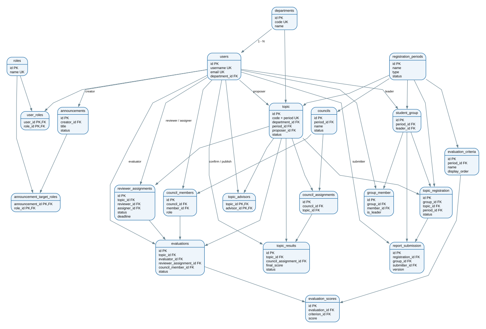

# Chương 4. Thiết kế cơ sở dữ liệu

## 4.1 Mục tiêu thiết kế

Cơ sở dữ liệu được thiết kế cho toàn bộ vòng đời đề tài môn học, NCKH, TLCN và KLTN. MySQL 8 là hệ quản trị dữ liệu của môi trường development/production; Flyway quản lý phiên bản schema. Các bảng nghiệp vụ đều kế thừa hai trường audit `created_at`, `updated_at`. Khóa ngoại có tên rõ ràng, các trường thường xuyên tìm kiếm có index và các luật có thể biểu diễn ở mức dữ liệu được bảo vệ bằng `UNIQUE` hoặc `CHECK` constraint.

Nguyên tắc quan trọng:

- Không lưu mật khẩu thô; bảng `users` chỉ lưu BCrypt hash.
- Không sửa migration đã được áp dụng; thay đổi schema luôn tạo migration mới.
- Không xóa cứng dữ liệu tham chiếu đang được sử dụng.
- File báo cáo nằm trên storage; database chỉ lưu metadata và phiên bản.
- Mỗi đề tài chỉ có tối đa một đăng ký ở trạng thái `APPROVED`.
- Mỗi giảng viên chỉ có một bộ đánh giá cho một đề tài và loại đánh giá.

## 4.2 Mô hình ERD

Hình 4.1. Mô hình ERD tổng thể của hệ thống. File nguồn có thể chỉnh sửa tại `diagrams/database-erd.dot`; bản PNG độ phân giải cao nằm tại `diagrams/database-erd.png`.

Các quan hệ trung tâm:

1. `users` liên kết nhiều-nhiều với `roles` qua `user_roles` và có thể thuộc một `department`.
2. `registration_periods` là thực thể gốc của đề tài, nhóm sinh viên, đăng ký, tiêu chí và hội đồng.
3. `topic` liên kết nhiều-nhiều với giảng viên hướng dẫn qua `topic_advisors`.
4. `student_group` có các thành viên trong `group_member`; nhóm đăng ký đề tài qua `topic_registration`.
5. `reviewer_assignments` và `council_assignments` xác định người/đơn vị được phép chấm đề tài.
6. `evaluations` chứa phiếu chấm; `evaluation_scores` chứa điểm từng tiêu chí.
7. `topic_results` lưu điểm cuối cùng, người xác nhận và người công bố.
8. `announcements` liên kết nhiều-nhiều với vai trò nhận thông báo qua `announcement_target_roles`.

## 4.3 Danh sách bảng và cột

Ký hiệu: **PK** – khóa chính, **FK** – khóa ngoại, **UK** – khóa duy nhất.

### 4.3.1 Tài khoản và phân quyền

| Bảng | Các cột chính | Mô tả |
|---|---|---|
| `roles` | `id` (PK), `name` (UK), `created_at`, `updated_at` | Danh mục quyền `ADMIN`, `FACULTY_MANAGER`, `LECTURER`, `STUDENT`. |
| `users` | `id` (PK), `username` (UK), `password_hash`, `full_name`, `email` (UK), `student_code`, `enabled`, `department_id` (FK), audit fields | Tài khoản, hồ sơ và trạng thái hoạt động của người dùng. |
| `user_roles` | `user_id` (PK, FK), `role_id` (PK, FK) | Bảng nối nhiều-nhiều giữa tài khoản và quyền. |
| `departments` | `id` (PK), `code` (UK), `name`, `description`, `active`, audit fields | Danh mục bộ môn trong khoa. |

### 4.3.2 Đợt, đề tài và nhóm sinh viên

| Bảng | Các cột chính | Mô tả |
|---|---|---|
| `registration_periods` | `id` (PK), `name`, `type`, `status`, `lecturer_start`, `lecturer_end`, `student_start`, `student_end`, `report_submission_deadline`, `review_deadline`, `council_date`, audit fields | Cấu hình từng đợt và các mốc thời gian nghiệp vụ. |
| `topic` | `id` (PK), `code`, `title`, `description`, `requirement`, `department_id` (FK), `registration_period_id` (FK), `status`, `proposer_id` (FK), `rejection_reason`, audit fields | Nội dung và trạng thái đề tài. Cặp `code`–`registration_period_id` là duy nhất. |
| `topic_advisors` | `topic_id` (PK, FK), `advisor_id` (PK, FK) | Danh sách một đến hai giảng viên hướng dẫn của đề tài. |
| `student_group` | `id` (PK), `registration_period_id` (FK), `leader_id` (FK), audit fields | Nhóm sinh viên thuộc một đợt, có một nhóm trưởng. |
| `group_member` | `id` (PK), `group_id` (FK), `member_id` (FK), `is_leader`, audit fields | Thành viên của nhóm; một tài khoản không lặp trong cùng nhóm. |
| `topic_registration` | `id` (PK), `student_group_id` (FK), `topic_id` (FK), `registration_period_id` (FK), `status`, `approver_id` (FK), `rejection_reason`, `approved_at`, `approved_topic_id` (generated, UK), audit fields | Phiếu đăng ký đề tài. Cột sinh `approved_topic_id` bảo đảm một đề tài chỉ có một nhóm được duyệt. |
| `report_submission` | `id` (PK), `student_group_id` (FK), `topic_registration_id` (FK), `submitter_id` (FK), `original_file_name`, `stored_file_name`, `content_type`, `file_size`, `version`, `note`, audit fields | Metadata các lần nộp báo cáo. Cặp đăng ký–phiên bản là duy nhất. |

### 4.3.3 Phản biện và hội đồng

| Bảng | Các cột chính | Mô tả |
|---|---|---|
| `reviewer_assignments` | `id` (PK), `topic_id` (FK), `reviewer_id` (FK), `assigner_id` (FK), `assigned_at`, `deadline`, `status`, `submission_time`, `note`, audit fields | Phân công phản biện và hạn nộp điểm của giảng viên. |
| `councils` | `id` (PK), `name`, `registration_period_id` (FK), `report_date`, `location`, `status`, audit fields | Thông tin hội đồng và lịch báo cáo. |
| `council_members` | `id` (PK), `council_id` (FK), `member_id` (FK), `role`, audit fields | Thành viên hội đồng với vai trò `CHAIR`, `SECRETARY` hoặc `MEMBER`. |
| `council_assignments` | `id` (PK), `council_id` (FK), `topic_id` (FK), audit fields | Gán đề tài đã được duyệt cho hội đồng. |

### 4.3.4 Chấm điểm và công bố kết quả

| Bảng | Các cột chính | Mô tả |
|---|---|---|
| `evaluation_criteria` | `id` (PK), `name`, `description`, `registration_period_id` (FK), `display_order`, `is_mandatory`, `is_active`, audit fields | Bộ tiêu chí chấm theo từng đợt; tên và thứ tự không trùng trong một đợt. |
| `evaluations` | `id` (PK), `topic_id` (FK), `evaluator_id` (FK), `evaluation_type`, `reviewer_assignment_id` (FK), `council_member_id` (FK), `status`, `comments`, `submission_time`, `locked_time`, audit fields | Một phiếu chấm của phản biện hoặc thành viên hội đồng. |
| `evaluation_scores` | `id` (PK), `evaluation_id` (FK), `criterion_id` (FK), `score`, `note`, audit fields | Điểm 0–10 theo từng tiêu chí; một tiêu chí không lặp trong cùng phiếu. |
| `topic_results` | `id` (PK), `topic_id` (FK, UK), `council_assignment_id` (FK, UK), `final_score`, `status`, `confirmer_id` (FK), `confirmed_time`, `publisher_id` (FK), `published_time`, audit fields | Điểm tổng kết, trạng thái xác nhận và công bố. |

### 4.3.5 Thông báo

| Bảng | Các cột chính | Mô tả |
|---|---|---|
| `announcements` | `id` (PK), `title`, `content`, `creator_id` (FK), `status`, `published_time`, `expiration_time`, audit fields | Thông báo nháp, đã công bố hoặc lưu trữ. |
| `announcement_target_roles` | `announcement_id` (PK, FK), `role_id` (PK, FK) | Các vai trò được phép nhận thông báo. |

## 4.4 Ràng buộc và chỉ mục quan trọng

- `uk_user_username`, `uk_user_email`: không trùng tài khoản/email.
- `uk_topic_code_period`: mã đề tài duy nhất trong từng đợt.
- `uk_group_member`: không thêm cùng sinh viên hai lần vào một nhóm.
- `uk_registration_group_period`: mỗi nhóm chỉ có một đăng ký trong một đợt.
- `uk_topic_registration_approved_topic`: mỗi đề tài chỉ có một đăng ký `APPROVED`.
- `uk_reviewer_assignment_topic_reviewer`: không phân công trùng phản biện.
- `uk_council_member`: một giảng viên không lặp trong hội đồng.
- `uk_evaluation_topic_evaluator_type`: một giảng viên chỉ có một phiếu hợp lệ cho đề tài và loại chấm.
- `uk_evaluation_score_criterion`: không nhập trùng tiêu chí trong một phiếu.
- `ck_evaluation_score_range`: điểm phải thuộc đoạn 0–10.
- Các index theo trạng thái, đợt, bộ môn, reviewer và deadline hỗ trợ danh sách lọc/dashboard.

Các luật có tính tổng hợp như tối đa hai GVHD, nhóm tối đa ba sinh viên, hội đồng 3–5 giảng viên, đúng một chủ tịch/thư ký và cấm chấm đề tài đang hướng dẫn được kiểm tra tại service trong transaction.

## 4.5 Quản lý phiên bản schema

| Migration | Nội dung |
|---|---|
| V1 | Tài khoản, quyền và bảng nối. |
| V2 | Bộ môn và liên kết người dùng–bộ môn. |
| V3 | Đợt đăng ký. |
| V4–V5 | Dữ liệu tham chiếu và đổi tên bộ môn An toàn thông tin. |
| V6 | Đề tài, GVHD, nhóm, đăng ký và báo cáo. |
| V7 | Phản biện, hội đồng, tiêu chí, đánh giá, kết quả và thông báo. |
| V8 | Năm tiêu chí mẫu cho các đợt hiện có. |
| V9 | Unique đăng ký được duyệt và bảo đảm tiêu chí theo đợt. |
| V10 | Chuyển việc sinh tiêu chí mặc định từ trigger sang service và backfill dữ liệu. |

Trong production, Hibernate dùng `ddl-auto=validate`; Flyway là thành phần duy nhất tạo hoặc thay đổi schema.
