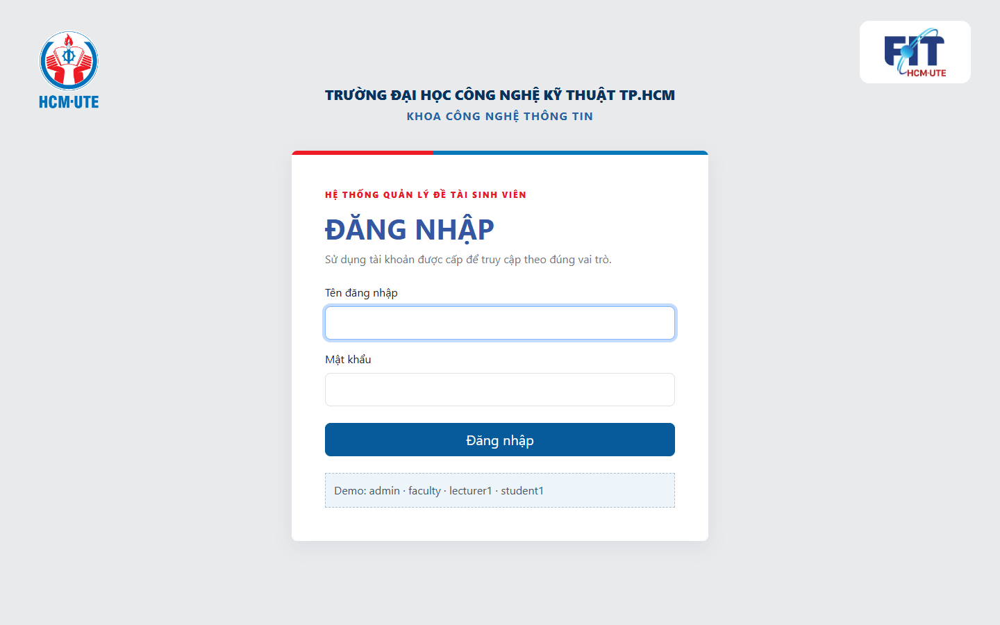
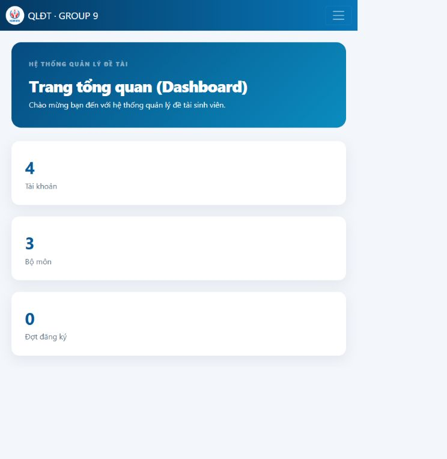
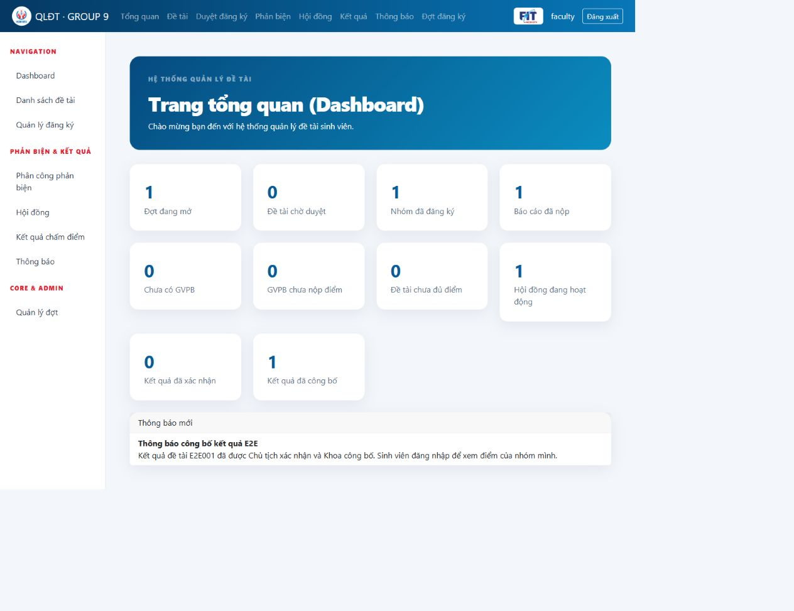
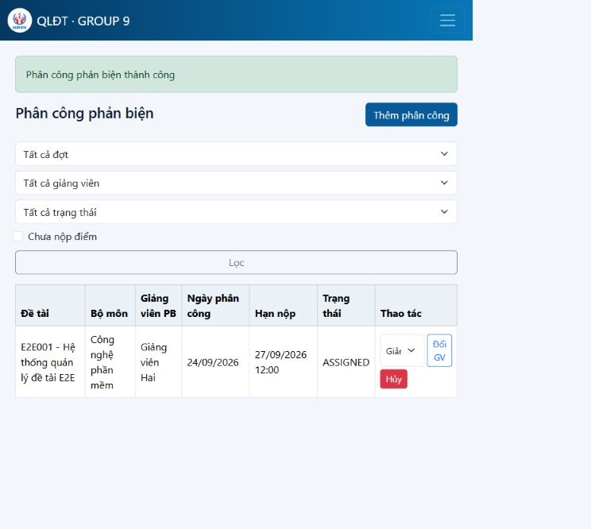
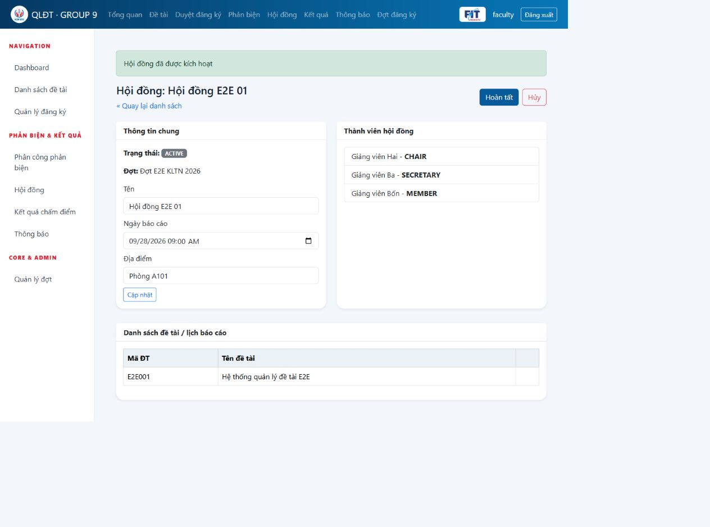
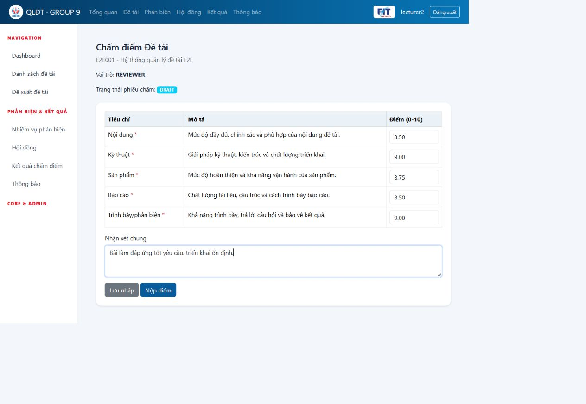
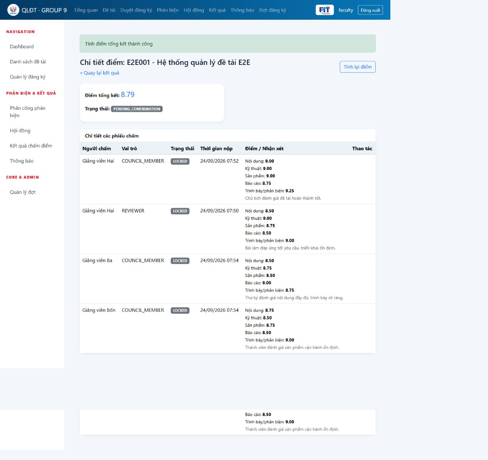
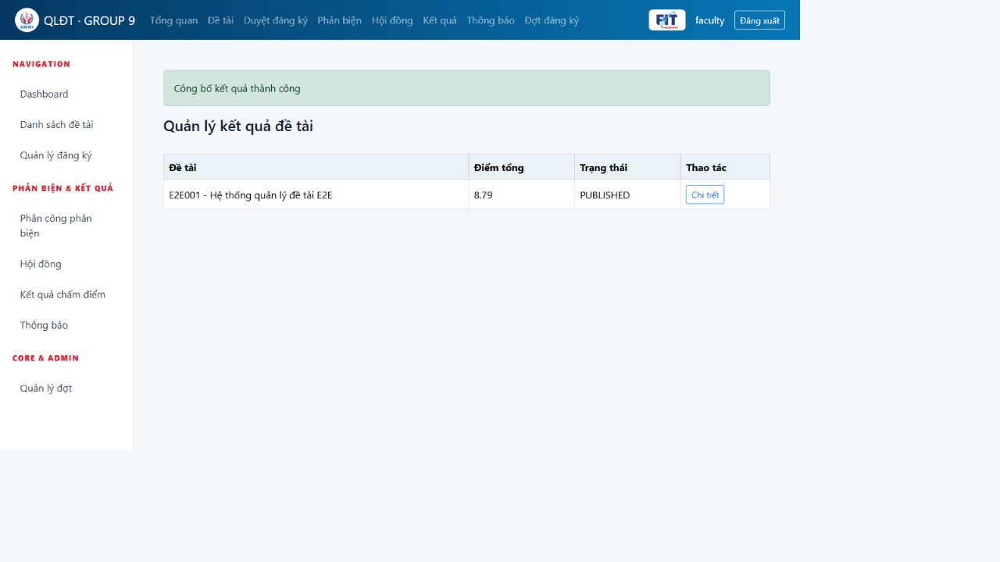
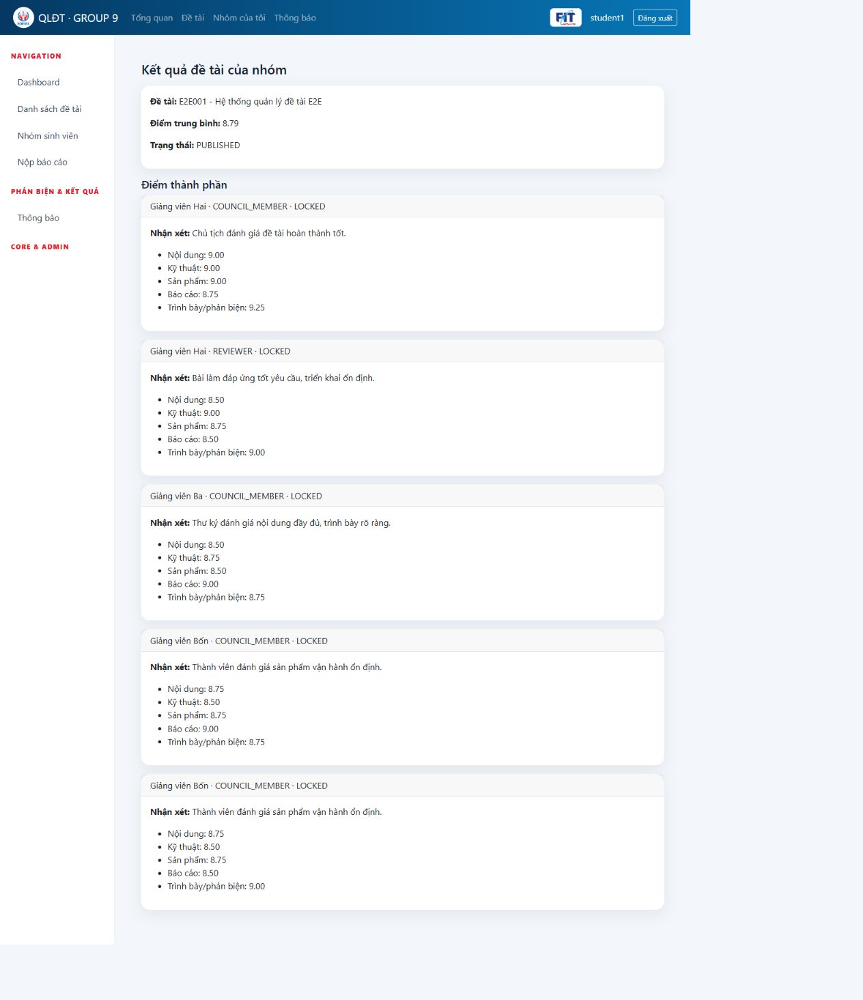
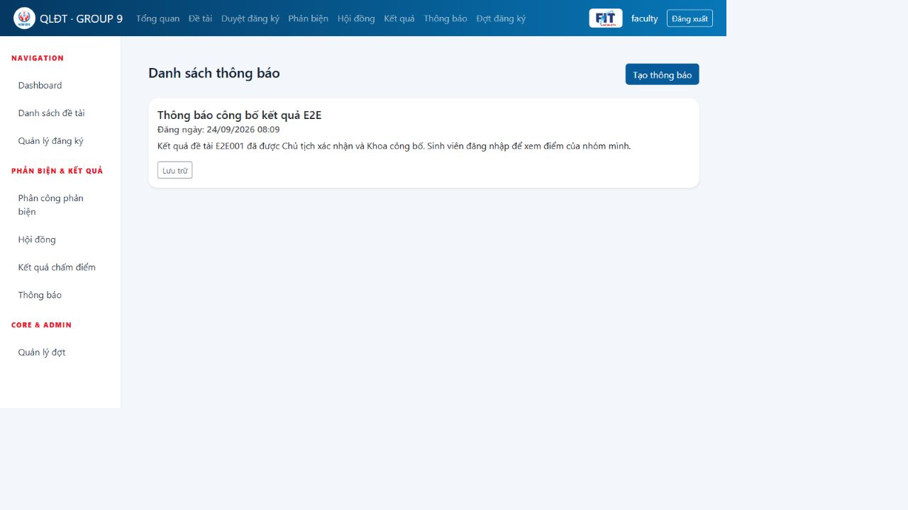

# Chương 5. Giao diện người dùng

Các hình trong chương này được chụp trực tiếp từ ứng dụng Spring Boot chạy với MySQL 8.0.46 ngày 24/09/2026. Ảnh không chứa mật khẩu, token hoặc bí mật triển khai.

## 5.1. Đăng nhập hệ thống

*Hình 5.1: Giao diện đăng nhập có nhận diện HCMUTE và Khoa Công nghệ Thông tin; người dùng được điều hướng theo vai trò sau khi xác thực.*

## 5.2. Quản trị và tổng quan

*Hình 5.2: Dashboard quản trị cung cấp lối vào quản lý tài khoản, bộ môn, đợt đăng ký và số liệu tổng quan hệ thống.*

*Hình 5.3: Dashboard cán bộ khoa tổng hợp tiến độ phản biện, hội đồng, kết quả và hiển thị thông báo mới theo vai trò.*

## 5.3. Quản lý đề tài, nhóm và báo cáo

*Hình 5.4: Danh sách đề tài hỗ trợ tra cứu theo đợt, bộ môn, trạng thái và từ khóa.*

*Hình 5.5: Giảng viên nhập thông tin đề tài và chọn tối đa hai giảng viên hướng dẫn.*

*Hình 5.6: Nhóm sinh viên thể hiện trưởng nhóm và các thành viên theo giới hạn nghiệp vụ.*

*Hình 5.7: Trạng thái đăng ký đã duyệt và các thao tác dành cho sinh viên.*

*Hình 5.8: Biểu mẫu nộp báo cáo và lịch sử phiên bản; tệp được lưu ngoài static web root.*

## 5.4. Phân công phản biện

*Hình 5.9: Cán bộ khoa phân công giảng viên phản biện, đặt hạn nộp và theo dõi trạng thái phiếu.*

## 5.5. Thành lập hội đồng

*Hình 5.10: Hội đồng E2E có ba thành viên, đúng một Chủ tịch, đúng một Thư ký và một Thành viên; đề tài được gán trước khi kích hoạt.*

## 5.6. Chấm điểm và khóa điểm

*Hình 5.11: Phiếu chấm gồm năm tiêu chí bắt buộc, điểm từ 0 đến 10 và phần nhận xét; giảng viên có thể lưu nháp trước khi nộp.*

*Hình 5.12: Bốn phiếu đã khóa, 20 điểm thành phần và điểm tổng kết 8,79 được tổng hợp trước khi Chủ tịch xác nhận.*

## 5.7. Xác nhận và công bố kết quả

*Hình 5.13: Kết quả E2E001 chuyển sang PUBLISHED sau khi Chủ tịch xác nhận và Khoa công bố.*

*Hình 5.14: Sinh viên thuộc nhóm xem điểm tổng 8,79, nhận xét và điểm thành phần; sinh viên ngoài nhóm bị từ chối 403.*

## 5.8. Thông báo

*Hình 5.15: Thông báo công bố kết quả được lọc theo vai trò và hiển thị đúng tiếng Việt trên danh sách.*

# Chương 6. Kết luận

## 6.1. Kết quả đạt được

Hệ thống đã hoàn thiện luồng nghiệp vụ từ quản trị tài khoản, tạo đợt, đề xuất và duyệt đề tài, lập nhóm, đăng ký, nộp báo cáo đến phản biện, hội đồng, chấm điểm, khóa điểm, xác nhận và công bố. Phiên E2E trên MySQL đi đủ 16 bước; điểm tổng kết thực tế là 8,79. Bộ kiểm thử tự động đạt 44/44 test. Health check, Flyway V1–V10, phân quyền, static resource và upload local đều được xác minh.

## 6.2. Ưu điểm

- Phân quyền được kiểm tra ở cả controller và service; URL trái quyền trả 403.
- Luật hội đồng 3–5 người, duy nhất một Chủ tịch và một Thư ký được cưỡng chế ở backend.
- Giảng viên chỉ chấm đề tài được phân công và không được chấm đề tài mình hướng dẫn.
- Phiếu phải đủ tiêu chí bắt buộc trước khi nộp; sau khi khóa không thể sửa.
- Quy trình công bố có hai lớp kiểm soát: Chủ tịch xác nhận, sau đó Khoa công bố.
- Sinh viên chỉ xem kết quả đã công bố của nhóm mình.
- Flyway quản lý schema; upload tách khỏi static; form Thymeleaf giữ CSRF.
- Dashboard và thông báo cung cấp số liệu/nhắc việc theo vai trò.

## 6.3. Hạn chế

- Chưa có URL production vì chưa có tài khoản và credential của nhà cung cấp hosting trong workspace.
- Máy kiểm thử hiện không cài Docker Desktop/CLI nên chưa tái chạy được Docker Compose; E2E được thực hiện bằng Maven với MySQL thật.
- Upload đang dùng local filesystem. Nếu hosting không có persistent disk, file sẽ mất khi restart hoặc redeploy.
- Chưa có email/push notification, object storage, xuất bảng điểm PDF và audit log quản trị chuyên sâu.
- Bộ ảnh được chụp ở desktop; responsive mới được kiểm tra cơ bản, chưa có ma trận trình duyệt/thiết bị đầy đủ.

## 6.4. Hướng phát triển

- Triển khai CI/CD và môi trường staging/production có health check tự động.
- Dùng persistent volume hoặc object storage S3-compatible cho báo cáo.
- Bổ sung gửi email khi phân công, sắp hết hạn, xác nhận và công bố kết quả.
- Xuất biên bản hội đồng, bảng điểm PDF/Excel có chữ ký số.
- Tự động hóa kiểm thử đa trình duyệt và mở rộng audit log/lịch sử thay đổi điểm.
