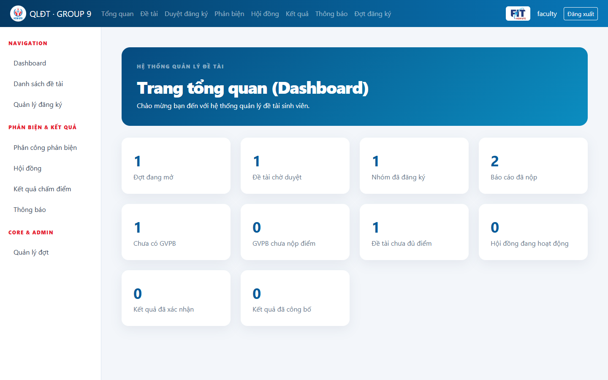

# Chương 5. Giao diện người dùng

Chương 5 chỉ dùng ảnh chụp sản phẩm đang chạy thật (không mockup). Mỗi hình có số, tên và mô tả.

Ảnh gốc dưới đây được chụp trực tiếp từ ứng dụng chạy local với Spring Boot và MySQL ngày 23/09/2026. Dữ liệu trong ảnh là dữ liệu demo, không chứa mật khẩu hay bí mật triển khai.

Các luồng cần chụp:

1. Đăng nhập theo vai trò.
2. Admin quản lý tài khoản và bộ môn.
3. Khoa tạo đợt đăng ký.
4. Giảng viên đề xuất, khoa duyệt và công bố đề tài.
5. Sinh viên tạo nhóm, đăng ký đề tài, nộp báo cáo.
6. Khoa phân công phản biện và thành lập hội đồng.
7. Giảng viên nhập điểm, khoa khóa điểm, chủ tịch xác nhận, khoa công bố.
8. Sinh viên xem kết quả nhóm mình.
9. Dashboard và thông báo theo vai trò.

## 5.1. Đăng nhập hệ thống

*Hình 5.1: Giao diện đăng nhập có logo HCMUTE và Khoa Công nghệ Thông tin.*

## 5.2. Dashboard của cán bộ khoa

*Hình 5.2: Dashboard tổng hợp số đợt mở, đề tài, nhóm, báo cáo, phản biện, hội đồng và kết quả.*

## 5.3. Danh sách đề tài

*Hình 5.3: Cán bộ khoa tra cứu đề tài theo đợt, bộ môn, trạng thái và từ khóa.*

## 5.4. Giảng viên đề xuất đề tài

*Hình 5.4: Biểu mẫu đề xuất đề tài của giảng viên.*

## 5.5. Nhóm sinh viên

*Hình 5.5: Nhóm có một trưởng nhóm và ba thành viên theo giới hạn nghiệp vụ.*

## 5.6. Đăng ký đề tài

*Hình 5.6: Đăng ký đã được duyệt và các thao tác xem, nộp báo cáo dành cho sinh viên.*

## 5.7. Nộp báo cáo và lịch sử phiên bản

*Hình 5.7: Biểu mẫu nộp báo cáo và lịch sử hai phiên bản đã lưu trong MySQL.*

# Chương 6. Kết luận

## 6.1. Kết quả đạt được

Hệ thống quản lý đề tài sinh viên đi hết luồng từ tạo đợt, đề xuất đề tài, đăng ký nhóm, nộp báo cáo đến phản biện, hội đồng, chấm điểm và công bố kết quả. Phân quyền Spring Security được kiểm tra ở backend. Schema do thành viên 1 quản lý qua Flyway.

## 6.2. Ưu điểm

- Tách module theo thành viên, đi qua service/contract.
- Ràng buộc hội đồng, phản biện và điểm được kiểm tra tại service.
- Điểm trung bình làm tròn `HALF_UP` hai chữ số thập phân.
- CSRF được giữ trên form Thymeleaf.

## 6.3. Hạn chế

- Chưa có URL hosting công khai nếu nhóm chưa đăng nhập nhà cung cấp.
- Upload lưu local disk, có thể mất khi container không gắn volume bền.
- Chưa có URL hosting công khai; bộ ảnh hiện được chụp từ môi trường local kết nối MySQL.

## 6.4. Hướng phát triển

- Gửi email khi công bố thông báo hoặc kết quả.
- Xuất bảng điểm PDF.
- Object storage cho file báo cáo.
